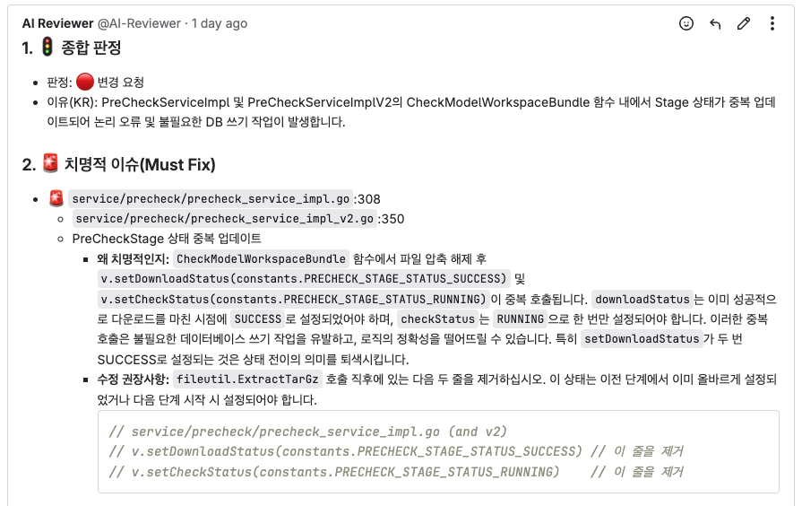

# Gitlab AI Code Reviewer

Gitlab AI Code Reviewer는 GitLab 저장소의 코드 변경 사항을 **자동으로 리뷰**해 주는 Flask 기반 웹 애플리케이션입니다.
GitLab Webhook(머지 요청 및 푸시 이벤트)을 받아 diff를 조회하고, 선택한 LLM(OpenAI, Gemini, Ollama, OpenRouter 등)을 사용해 코드 리뷰 코멘트를 생성한 뒤, GitLab에 **마크다운 형식의 댓글**로 남깁니다.



---

## 개요

- GitLab에서 발생하는 다음 이벤트를 처리합니다.
  - 머지 요청 이벤트(`object_kind = "merge_request"`, action: `open`/`update`/`reopen`인 경우 처리)
  - 푸시 이벤트(`object_kind = "push"`)
- 각 이벤트에 대해 GitLab API로 diff를 조회한 뒤, LangChain LLM 클라이언트를 통해 선택한 provider(OpenAI, Gemini, Ollama, OpenRouter 등)로 리뷰를 생성합니다.
- 생성된 리뷰를 다음 위치에 댓글로 남깁니다.
  - 머지 요청: MR Note
  - 커밋: Commit Comment

애플리케이션은 단일 HTTP 엔드포인트를 제공합니다.

- `POST /webhook`

GitLab Webhook은 이 엔드포인트로 이벤트를 전송해야 합니다.

---

## 주요 기능

- GitLab 코드 변경 사항 자동 리뷰
- 코드 가독성, 구조, 복잡도, 잠재적 버그 및 보안 이슈에 대한 피드백
- GitLab에서 바로 읽기 좋은 **마크다운 형식**의 코멘트 생성
- 머지 요청과 푸시(커밋)에 모두 대응
- LangChain 기반 LLM 추상화로 **OpenAI, Google Gemini, Ollama, OpenRouter** 중 원하는 provider 선택 가능

---

## 내부 동작 흐름

### 1. 머지 요청(Merge Request) 플로우

1. GitLab에서 MR이 **open**/**update**/**reopen** 상태 이벤트를 발생시키면 Webhook 호출
2. 헤더 `X-Gitlab-Token` 값을 `GITLAB_WEBHOOK_SECRET_TOKEN` 환경 변수와 비교하여 인증
3. 아래 GitLab API로 MR diff 조회

   ```text
   GET {GITLAB_URL}/api/v4/projects/{project_id}/merge_requests/{mr_iid}/changes
   ```

4. 응답에서 `changes[].diff`를 추출해 하나의 문자열로 합침
5. 리뷰 프롬프트(질문 목록 포함)를 구성하고 LangChain LLM 클라이언트를 통해 선택한 provider(OpenAI, Gemini, Ollama, OpenRouter 등)로 리뷰를 생성
6. 생성된 리뷰를 아래 API로 MR 댓글로 등록

   ```text
   POST {GITLAB_URL}/api/v4/projects/{project_id}/merge_requests/{mr_iid}/notes
   ```

### 2. 푸시(Push) / 커밋 플로우

1. GitLab에서 푸시 이벤트 발생 시 Webhook 호출
2. 헤더 토큰을 동일하게 검증
3. 아래 GitLab API로 커밋 diff 조회

   ```text
   GET {GITLAB_URL}/api/v4/projects/{project_id}/repository/commits/{commit_id}/diff
   ```

4. diff 목록을 문자열로 합쳐 프롬프트에 포함
5. LangChain LLM 클라이언트를 통해 선택한 provider(OpenAI, Gemini, Ollama, OpenRouter 등)로 리뷰 생성
6. 생성된 리뷰를 아래 API로 커밋 댓글로 등록

   ```text
   POST {GITLAB_URL}/api/v4/projects/{project_id}/repository/commits/{commit_id}/comments
   ```

오류가 발생하면 콘솔에 예외를 출력하고, GitLab 댓글에 에러 메시지를 포함한 안내 문구를 남깁니다.

---

## 요구 사항

- Python **3.11 이상** (프로젝트 `pyproject.toml` 및 uv 기준)
- GitLab 프로젝트 1개 이상 (Webhook 설정 권한 필요)
- OpenAI API Key (LLM_PROVIDER=openai 인 경우 필요)
- OpenRouter API Key (LLM_PROVIDER=openrouter 인 경우 필요)
- GitLab Personal Access Token (API 권한 포함)
- Docker 및 docker-compose (선택, 컨테이너 실행용)

Python 의존성은 `pyproject.toml`로 관리되며, 로컬 개발 시 **uv** 사용을 권장합니다.

---

## 환경 변수 설정

이 애플리케이션은 모든 설정을 **환경 변수**로 받습니다. 루트 디렉터리에 `.env` 파일을 두고 관리하거나, 쉘에서 직접 export 해도 됩니다.

### 빠른 시작 .env 예시

```env
LLM_PROVIDER=openai # LLM provider [openai (default) / gemini / ollama / openrouter]
LLM_MODEL=gpt-5-mini # LLM 모델명 [gpt-5-mini (default) , gemini-2.5-pro, llama3, ...]
LLM_TIMEOUT_SECONDS=300 # LLM API timeout seconds [default: 300]

OPENAI_API_KEY=your-openai-api-key # provider=openai 인 경우 필요
GOOGLE_API_KEY=your-google-api-key # provider=gemini 인 경우 필요
OLLAMA_BASE_URL=http://localhost:11434 # provider=ollama 인 경우 필요 [default: http://localhost:11434]
OPENROUTER_API_KEY=your-openrouter-api-key # provider=openrouter 인 경우 필요
OPENROUTER_BASE_URL=https://openrouter.ai/api/v1 # provider=openrouter 인 경우 선택 (기본값: https://openrouter.ai/api/v1)

GITLAB_ACCESS_TOKEN=your-gitlab-personal-access-token
GITLAB_URL=https://gitlab.com
GITLAB_WEBHOOK_SECRET_TOKEN=your-webhook-secret-token

# (선택) LLM 모니터링 웹훅 설정
# LLM_MONITORING_WEBHOOK_URL 이 설정된 경우, 각 리뷰 시도(머지 요청/푸시)에 대해 JSON payload를 POST로 전송합니다.
LLM_MONITORING_WEBHOOK_URL=https://example.com/llm-monitoring-webhook
```

### 세부 설정 포함 `.env` 전체 예시

[.env.sample](./.env.sample)

### 테스트 환경(.env) 및 pytest

- 루트 디렉터리의 `.env` 파일은 `tests/conftest.py` 에서 `python-dotenv` 로 자동 로드됩니다.
- `tests/test_gitlab_client_env.py` 는 실제 GitLab API를 호출하는 **통합 테스트**이며, 다음 조건에서만 실행됩니다.
  - `GITLAB_URL`
  - `GITLAB_ACCESS_TOKEN`
  - `GITLAB_TEST_PROJECT_ID`
  - `GITLAB_TEST_MERGE_REQUEST_IID`
  - `GITLAB_TEST_COMMIT_ID`
- 위 환경변수가 설정되지 않은 경우, 해당 테스트는 `pytest.skip` 으로 자동 건너뜁니다.

테스트 실행 예시는 다음과 같습니다.

- 전체 테스트 실행 (uv 기반 권장):

  ```bash
  uv sync          # 의존성 및 가상환경 동기화
  uv run pytest    # 또는 uv run python -m pytest
  ```

- 통합 테스트만 선택 실행:
  ```bash
  uv run pytest -m integration
  ```

---

## 실행 방법

### 1. Docker + docker-compose로 실행 (권장)

이 저장소에는 `Dockerfile`과 `docker-compose.yaml`이 포함되어 있습니다.

1. 프로젝트 루트에 `.env` 파일이 있는지 확인합니다.
2. Docker 이미지 빌드:

   ```bash
   docker-compose build
   ```

3. 컨테이너 실행:

   ```bash
   docker-compose up -d
   ```

기본 설정은 다음과 같습니다.

- 컨테이너 내부 포트: `9655`
- `docker-compose.yaml` 포트 매핑:

  ```yaml
  ports:
    - "9655:9655"
  ```

따라서 외부에서 접근하는 Webhook URL은 다음과 같습니다.

```text
http://localhost:9655/webhook
```

컨테이너 내부에서는 다음 커맨드로 애플리케이션이 실행됩니다.

```bash
gunicorn --bind 0.0.0.0:9655 src.main:app
```

---

## GitLab Webhook 설정

GitLab 프로젝트에서 Webhook을 아래와 같이 설정합니다.

1. 프로젝트 메뉴에서 `Settings` → `Webhooks`로 이동합니다.
2. **URL** 입력:

   - 로컬 개발 (Flask 개발 서버):

     ```text
     http://YOUR-HOST:9655/webhook
     ```

   - Docker (docker-compose 사용):

     ```text
     http://YOUR-HOST:9655/webhook
     ```

3. **Secret token** 입력:

   - `.env`에 설정한 `GITLAB_WEBHOOK_SECRET_TOKEN`과 **동일한 값**을 입력합니다.

   - `GITLAB_WEBHOOK_SECRET_TOKEN` 값은 충분히 긴 랜덤 문자열을 사용하는 것을 권장합니다. 예를 들어 macOS / Linux에서 다음과 같이 생성할 수 있습니다.

     ```bash
     # OpenSSL 사용 (hex 32바이트)
     openssl rand -hex 32

     # 또는 Python 내장 secrets 사용
     python - << 'PY'
     import secrets
     print(secrets.token_hex(32))
     PY
     ```

     생성된 값을 `.env`의 `GITLAB_WEBHOOK_SECRET_TOKEN`에 설정하고, 이 섹션의 Secret token 입력란에도 동일한 값을 넣어야 합니다.

4. Trigger 이벤트 선택:

   - ✅ `Merge requests events`
   - ✅ `Push events`

5. (선택) Webhook 화면에서 `Test` 버튼을 사용해 푸시/머지 요청 이벤트를 테스트할 수 있습니다.

토큰이 일치하지 않으면 애플리케이션은 `403 Unauthorized`를 반환합니다.

---

## 동작 방식 요약 (프롬프트)

각 이벤트 처리 시 애플리케이션은:

1. GitLab에서 diff를 조회해 하나의 문자열로 합칩니다.
2. 파일 상태(추가/삭제/리네임/수정)를 포함해 diff를 파일 단위로 정리하고, 시니어 코드 리뷰어 역할과 체크리스트(요약, 코드 품질, 버그/로직, 보안, 제안)를 담은 프롬프트를 구성합니다. 이때 LLM이 먼저 **한국어 리뷰**, 이어서 `---` 한 줄, 그리고 **동일 구조의 영어 리뷰**를 생성하도록 지시합니다.
3. LangChain LLM 클라이언트를 통해 `LLM_PROVIDER` / `LLM_MODEL` 설정에 맞는 모델을 호출합니다. 기본값은 OpenAI `gpt-5-mini` 입니다.
4. 응답 내용을 정리해 GitLab에 마크다운 댓글로 등록합니다.

에러 발생 시:

- 콘솔에 예외를 출력합니다.
- GitLab 댓글에는 “지금은 사람이 리뷰해야 한다”는 안내와 함께 에러 메시지를 포함합니다.

---

## 문제 해결 (Troubleshooting)

- **403 Unauthorized 발생**

  - GitLab Webhook 설정의 **Secret token**이 `GITLAB_WEBHOOK_SECRET_TOKEN`과 같은지 확인합니다.
  - Webhook 요청이 올바른 URL/포트(`/webhook`)로 가고 있는지 확인합니다.

- **머지 요청/커밋에 리뷰 댓글이 안 달리는 경우**

  - GitLab Webhook 화면의 "Recent Deliveries"에서 이벤트가 실제로 전송되었는지 확인합니다.
  - 컨테이너/애플리케이션 로그에 에러가 없는지 확인합니다.
  - `GITLAB_ACCESS_TOKEN`에 충분한 권한이 있는지, `GITLAB_URL`이 올바른지 점검합니다.

- **LLM 관련 에러**

  - `LLM_PROVIDER`, `LLM_MODEL`, `LLM_TIMEOUT_SECONDS` 가 올바른지 확인합니다.
  - `LLM_PROVIDER`에 따라 필요한 API 키가 설정되어 있는지 확인합니다. 예) `LLM_PROVIDER=openai` 인 경우 `OPENAI_API_KEY`, `LLM_PROVIDER=gemini` 인 경우 `GOOGLE_API_KEY`, `LLM_PROVIDER=openrouter` 인 경우 `OPENROUTER_API_KEY` 가 필요합니다.
  - 429(Too Many Requests) 등 빈번한 rate limit 에러가 발생하는 경우, `LLM_MAX_RETRIES` 값을 조절해 재시도 횟수를 관리하거나, 호출 빈도/모델을 조정해야 할 수 있습니다. 기본값은 `0`(자동 재시도 없음)입니다.

---

## LLM 모니터링 웹훅

`LLM_MONITORING_WEBHOOK_URL` 환경 변수가 설정된 경우, 각 리뷰 시도(머지 요청 / 푸시)에 대해
LLM 호출 결과를 JSON으로 POST 합니다. 성공/실패는 `status` 필드로 구분됩니다.

### 1. 공통 필드

```jsonc
{
  "status": "success" | "error",           // 호출 성공/실패 구분
  "event": "merge_request_review" | "push_review",
  "source": "gitlab-ai-code-reviewer",      // 발신자 식별자
  "timestamp": "2025-12-11T08:45:12.345678+00:00", // UTC ISO8601
  "gitlab": { ... },
  "llm": { ... },
  "review": { ... }, // 성공 시에만 존재
  "error": { ... }   // 실패 시에만 존재
}
```

### 2. 성공(payload.status = "success") 예시

머지 요청 리뷰 성공 시 예시:

```jsonc
{
  "status": "success",
  "event": "merge_request_review",
  "source": "gitlab-ai-code-reviewer",
  "timestamp": "2025-12-11T08:45:12.345678+00:00",
  "gitlab": {
    "api_base_url": "http://gitlab.example.com/api/v4",
    "project_id": 42,
    "merge_request_iid": 3
  },
  "llm": {
    "provider": "openrouter",
    "model": "mistralai/devstral-2512:free",
    "elapsed_seconds": 12.34,
    "input_tokens": 1234,
    "output_tokens": 567,
    "total_tokens": 1801
  },
  "review": {
    "content": "... LLM이 생성한 리뷰 전체 텍스트 ...",
    "length": 1024
  }
}
```

푸시(커밋) 리뷰 성공 시에는 `gitlab` 블록만 다음처럼 달라집니다.

```jsonc
"gitlab": {
  "api_base_url": "http://gitlab.example.com/api/v4",
  "project_id": 42,
  "commit_id": "abc123def456"
}
```

### 3. 실패(payload.status = "error") 예시

예를 들어 OpenRouter rate limit 등으로 리뷰 생성이 실패한 경우:

```jsonc
{
  "status": "error",
  "event": "merge_request_review",
  "source": "gitlab-ai-code-reviewer",
  "timestamp": "2025-12-11T08:50:00.123456+00:00",
  "gitlab": {
    "api_base_url": "http://gitlab.example.com/api/v4",
    "project_id": 42,
    "merge_request_iid": 3
  },
  "llm": {
    "provider": "openrouter",
    "model": "mistralai/devstral-2512:free"
  },
  "error": {
    "type": "RateLimitError",
    "message": "Rate limit exceeded: free-models-per-day...",
    "detail": "RateLimitError('Rate limit exceeded: free-models-per-day...')"
  }
}
```

푸시(커밋) 리뷰 실패 시에도 동일 구조에서 `gitlab.commit_id`만 포함됩니다.

---

## 한계 및 주의사항

- 전체 코드베이스가 아닌 git diff 정보만을 가지고 대답하기 때문에 답변이 정확하지 않을 수 있습니다.
- 머지 요청의 경우 `action = "open"`, `"update"`, `"reopen"` 이벤트를 처리합니다.
- 매우 큰 diff의 경우 토큰 제한에 걸릴 수 있습니다.
- 이 도구는 **인공지능 보조 도구**일 뿐이며, 최종 리뷰 책임은 항상 사람에게 있습니다. AI가 제안한 내용을 그대로 수용하기보다는 참고 자료로 활용하는 것을 권장합니다.
